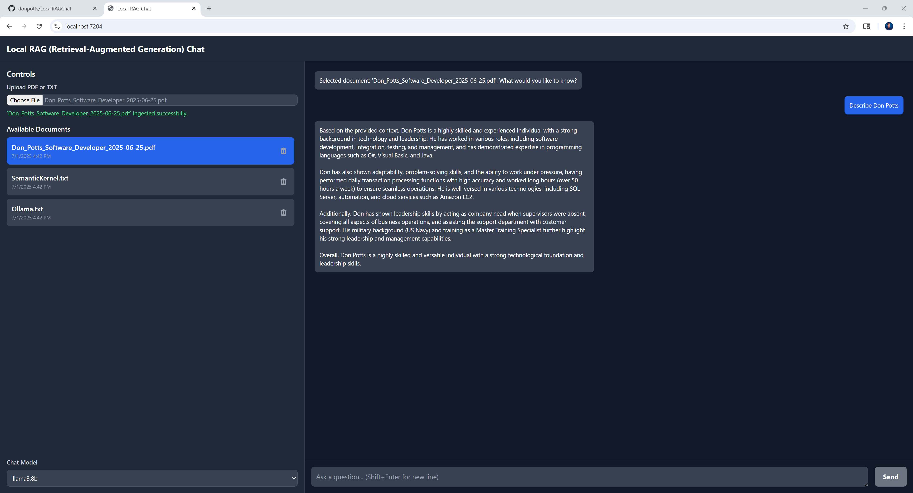

# 🚀 Local RAG Chat with C# Semantic Kernel and Ollama

**Local RAG Chat** is a fully self-contained, offline-first RAG (Retrieval-Augmented Generation) application that lets you chat with your PDF and text documents locally. No data ever leaves your machine.

It features a clean, modern Blazor WASM frontend styled with Tailwind CSS and a robust ASP.NET Core backend powered by Microsoft Semantic Kernel. All AI processing for embeddings and chat is handled by a local [Ollama](https://ollama.com) instance, ensuring 100% privacy and control.




## ✨ Core Features

*   **100% Local & Offline**: Your documents and conversations never touch the internet.
*   **Ingest PDF & TXT Files**: Upload your documents through the web UI for processing.
*   **Retrieval-Augmented Generation (RAG)**: The app finds the most relevant parts of your document to provide accurate, context-aware answers.
*   **Modern Web UI**: A responsive and intuitive chat interface built with Blazor WASM and Tailwind CSS.
*   **Powered by Ollama**: Leverages local LLMs for both generating vector embeddings and chat completions.
*   **Dynamic Model Selection**: Easily switch between multiple local chat models (e.g., Llama 3, Mistral, Phi-3) directly from the UI.
*   **Persistent Storage**: Uses EF Core and a local SQLite database to store document metadata and text chunks.

## 🏛️ Architecture

The project is architected with a clean separation between the frontend client and the backend API, enabling scalability and maintainability.


## 🛠️ Technology Stack

| Area | Technology | Purpose |
| :--- | :--- | :--- |
| **Frontend** | Blazor WebAssembly | Rich, interactive C#-based web UI. |
| | Tailwind CSS | Utility-first CSS framework for rapid UI development. |
| **Backend** | ASP.NET Core 9 Web API | High-performance API for handling business logic. |
| | C# 12 | Modern, powerful language for the entire stack. |
| **AI/Orchestration** | Semantic Kernel | Microsoft's SDK for orchestrating AI plugins and memory. |
| | Ollama | Runs open-source LLMs locally for embeddings and chat. |
| **Database** | Entity Framework Core 8 | ORM for interacting with the database. |
| | SQLite | Lightweight, serverless, file-based database for local storage. |
| **Data Parsing**| PdfPig | Extracts text from PDF documents. |
| | CsvHelper | Parses CSV files for initial database seeding. |


## ✅ Prerequisites

Before you begin, ensure you have the following installed:

1.  **.NET 9 SDK**: [Download here](https://dotnet.microsoft.com/download/dotnet/9.0)
2.  **Node.js and npm**: [Download here](https://nodejs.org/) (Required for Tailwind CSS)
3.  **Ollama**: [Install from ollama.com](https://ollama.com)

After installing Ollama, pull the necessary models from your terminal:

```bash
# A model for generating embeddings
ollama pull nomic-embed-text

# A few chat models for the selector
ollama pull phi3
ollama pull mistral
ollama pull llama3:8b
```

## ⚙️ Setup and Running Instructions

Follow these steps to get the application running locally.

### 1. Clone the Repository

```bash
git clone https://github.com/donpotts/LocalRAGChat.git
cd LocalRAGChat
```

### 2. Start Ollama

Ensure the Ollama desktop application is running on your machine.

### 3. Run the Backend Server (`LocalRAGChat.Server`)

The backend must be running before you start the frontend.

```bash
# Navigate to the server project directory
cd LocalRAGChat.Server

# Restore dependencies
dotnet restore

# Apply database migrations. This creates and seeds the localragchat.db file.
dotnet ef database update

# Run the server
dotnet run
```
The API will now be running, typically at `https://localhost:7216`.

### 4. Run the Frontend Client (`LocalRAGChat.Client`)

Open a **new terminal window** for this step.

```bash
# Navigate to the client project directory
cd LocalRAGChat.Client

# Install Node.js dependencies for Tailwind CSS
npm install

# Run the Tailwind CSS compiler in watch mode
# This will automatically rebuild your CSS as you make changes
npm run build:css

# Keep the Tailwind process running. In another terminal, run the Blazor app:
dotnet run
```
Your default browser should open to the application, typically at `https://localhost:7054`.

## 📖 How to Use

1.  **Launch the App**: Once the client and server are running, the web UI will load.
2.  **Select a Document**: The sidebar will be pre-populated with documents from the seed data. Click one to start a chat session.
3.  **Select a Model**: Use the dropdown menu in the sidebar to choose which Ollama model you want to chat with.
4.  **Ask a Question**: Type your question about the selected document in the input box and press Enter. The AI will respond with information retrieved from the document.
5.  **Upload New Documents**: Use the "Upload" button to ingest new PDF or TXT files. They will appear in the document list, ready for you to chat with.

## 📂 Project Structure

The solution is organized into three distinct projects for a clean separation of concerns:

```
/
├── LocalRAGChat.Client/     # The Blazor WASM frontend project and all UI components.
├── LocalRAGChat.Server/     # The ASP.NET Core Web API, services, data models, and database logic.
└── LocalRAGChat.Shared/     # A class library for DTOs shared between the client and server.
```

---

**NOTE: This project is designed to run entirely on your local machine. The AI Models require a fast and powerful computer for quick responses. It does not require any cloud services or external APIs, ensuring complete data privacy and control.**

## 📞 Contact

For any questions, feedback, or inquiries, please feel free to reach out.

**Don Potts** - [Don.Potts@DonPotts.com](mailto:Don.Potts@DonPotts.com)
